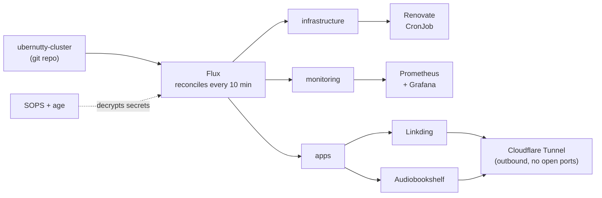

# Reese Nelson

I build systems that make mistakes harder to make and repetitive work unnecessary.

Remote · Certified Kubernetes Administrator · [LinkedIn](https://www.linkedin.com/in/reesenelson/)

## What I'm about

I like to question the default choice and look for the overlooked option that solves a problem people stopped noticing. That's been the pattern for years across unrelated things: the keyboard layout I type on, the OS my machines run, how my home network is put together. Lately I've been pointing it at infrastructure.

Everything below is self-directed work. It's a homelab, not a production estate, and I'd rather say that plainly than dress it up. What it does show is how I approach infrastructure when nobody is grading it: version everything, automate the boring parts, and make the system tell me when it drifts instead of waiting to find out the hard way.

## The homelab, as it actually runs

No `kubectl apply` by hand. If it isn't committed, it isn't running. Renovate opens its own PRs when a base image or a Flux controller falls behind, so dependency drift shows up as a pull request instead of a surprise.

<!-- LIVE:START -->
### Live cluster state

Rebuilt daily by a GitHub Action that reads the cluster repo, not the cluster.

| | |
|---|---|
| Flux | `v2.9.3` |
| Last infrastructure change | 2026-07-28 (14 days ago) |
| Renovate dependency PRs | 4 open, 6 merged in the last 30 days |
| Apps under GitOps | 2 |

Updated 2026-08-12 07:48 UTC
<!-- LIVE:END -->

## Claims, and where to check them

Every row points at a public repo. Feel free to go read the actual manifests instead of taking my word for it.

| What | Where | What's in there |
|---|---|---|
| GitOps and continuous reconciliation | [ubernutty-cluster](https://github.com/MechHead777/ubernutty-cluster) | Flux applying layered kustomizations, cluster state driven entirely from git |
| Secrets management | [ubernutty-cluster](https://github.com/MechHead777/ubernutty-cluster) | SOPS + age. No plaintext secret has ever been committed, private repo or not |
| Observability | [ubernutty-cluster](https://github.com/MechHead777/ubernutty-cluster) | kube-prometheus-stack, dashboards I actually look at |
| Dependency hygiene | [ubernutty-cluster](https://github.com/MechHead777/ubernutty-cluster) | Self-hosted Renovate CronJob raising PRs on drift |
| Container fundamentals | [container-practice](https://github.com/MechHead777/container-practice) | Multi-stage builds, non-root UIDs end to end, compose dependency ordering that waits on real completion |
| Bare-metal provisioning | [arch-bootstrap](https://github.com/MechHead777/arch-bootstrap) | Two-stage Arch installer: LUKS2, btrfs, systemd-boot, then a chezmoi layer covering shell, Neovim, and mise-pinned runtimes on bare metal and WSL alike |
| Declarative systems | [nixos-backup](https://github.com/MechHead777/nixos-backup) | Whole desktop reproducible from a flake with one command |
| Kubernetes fundamentals | [k8s-for-dummy](https://github.com/MechHead777/k8s-for-dummy) | Rolling vs. recreate strategies compared side by side, namespaces, a real self-hosted app |
| Firmware debugging | [my-vial-keyboards](https://github.com/MechHead777/my-vial-keyboards) | QMK/Vial keymaps, plus porting boards off memory-starved AVR chips to RP2040 |

## Certifications

**Certified Kubernetes Administrator (CKA)** · Credential ID `LF-rf1c3fcxxm` · [verify](https://training.linuxfoundation.org/certification/verify/)

CompTIA A+, Network+, and Security+: earned, now lapsed. Listing them for accuracy, not claiming them as current.

## How I work

I'd rather spend an afternoon making a problem impossible than five minutes fixing it every week. Most of what's in these repos started as something I did by hand twice and got annoyed about.

I'm still learning plenty here, and I'll say so when I am. Stop chasing smoke. Prevent the fire.
