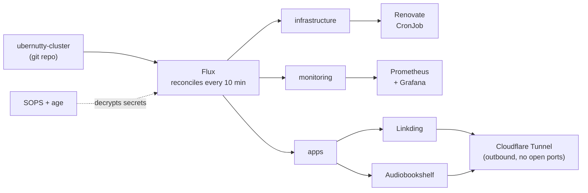

# Reese Nelson

I build automated systems that decrease mistakes and reduce repetitive work.

Remote · Certified Kubernetes Administrator · [LinkedIn](https://www.linkedin.com/in/reesenelson/)

## The Homelab

<!-- LIVE:START -->
### Live cluster state

| | |
|---|---|
| Flux | `v2.9.5` |
| Last infrastructure change | 2026-09-07 (today) |
| Renovate dependency PRs | none open, 6 merged in the last 30 days |
| Apps under GitOps | 2 |

Updated 2026-09-08 11:11 UTC
<!-- LIVE:END -->

## Projects

| What | Where | What's in there |
|---|---|---|
| GitOps and continuous reconciliation | [ubernutty-cluster](https://github.com/MechHead777/ubernutty-cluster) | Flux applying layered kustomizations, cluster state driven entirely from git |
| Secrets management | [ubernutty-cluster](https://github.com/MechHead777/ubernutty-cluster) | SOPS + age. No plaintext secret has ever been committed |
| Observability | [ubernutty-cluster](https://github.com/MechHead777/ubernutty-cluster) | kube-prometheus-stack dashboards |
| Dependency hygiene | [ubernutty-cluster](https://github.com/MechHead777/ubernutty-cluster) | Self-hosted Renovate CronJob raising PRs when a new version releases |
| Container fundamentals | [container-practice](https://github.com/MechHead777/container-practice) | Multi-stage builds |
| Declarative systems | [nixos-backup](https://github.com/MechHead777/nixos-backup) | Whole desktop reproducible from a flake with one command |
| Firmware debugging | [my-vial-keyboards](https://github.com/MechHead777/my-vial-keyboards) | QMK/Vial keymaps, plus porting boards off memory-starved AVR chips to RP2040 |

## Certifications

**Certified Kubernetes Administrator (CKA)** · Credential ID `LF-rf1c3fcxxm` · [verify](https://training.linuxfoundation.org/certification/verify/)

CompTIA A+, Network+, and Security+: earned, now lapsed. Listing them for accuracy, not claiming them as current.
